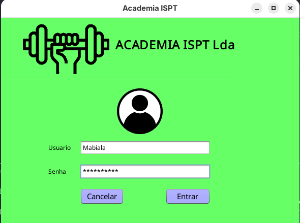
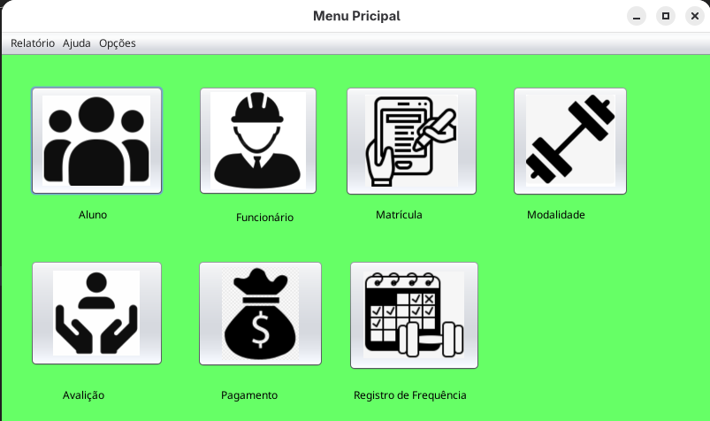
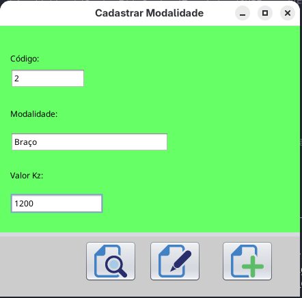
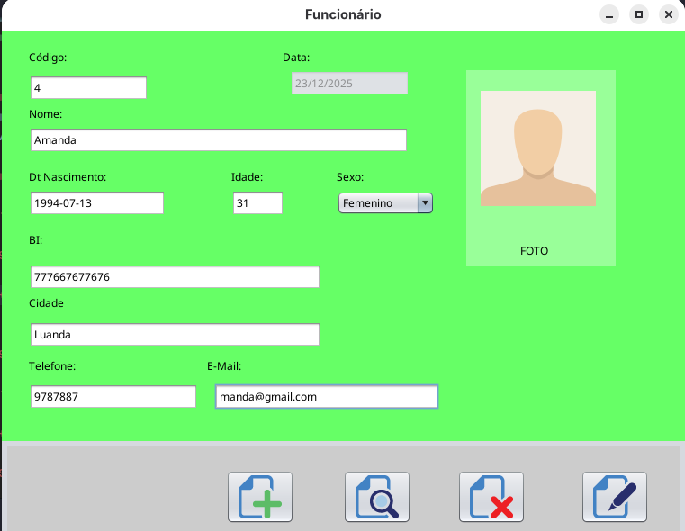
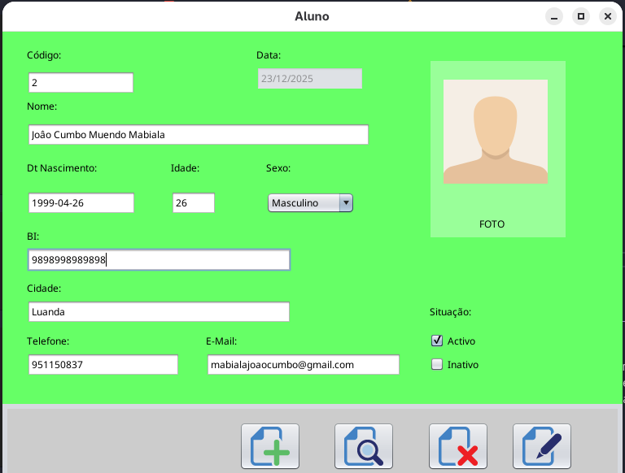
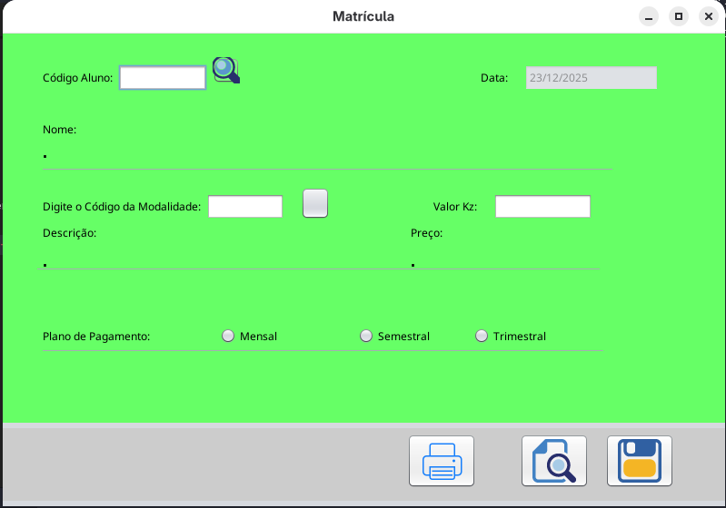
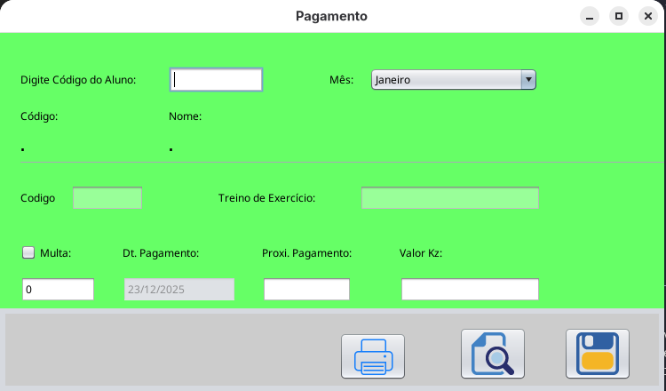
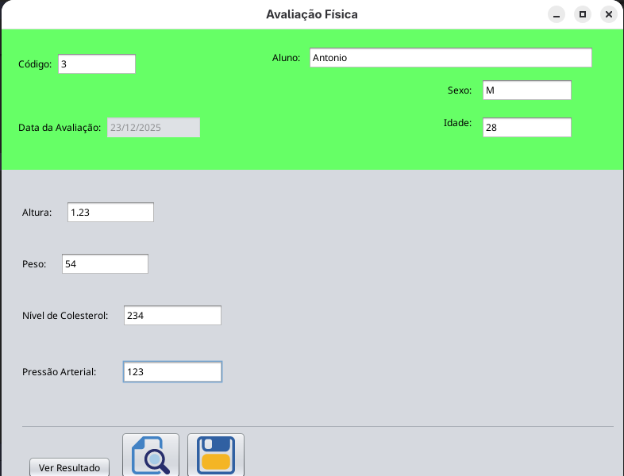
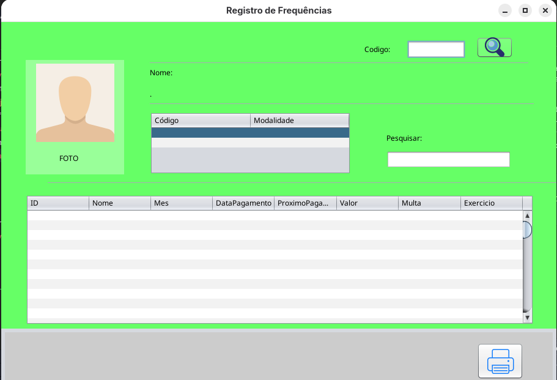

<h1 align="center">
     Academia ISPT
</h1>
 <h2 align="center">
     Sistema de Gestão de Academia de Ginásio 
</h2>

 ## Este sistema consiste em:
 - Cadastrar Aluno
 - Cadastrar Personal Treiner
 - Cadastrar Modalidades de exercícios
 - Matricular Aluno e selecionar quais modalidade de exercícios
 - Controlar a Frequencia dos Alunos
 - Controlo de Mensalidades Pagas
 - Avaliação Física do Aluno
 - Imprimir o Relatório

### Tela de Login

### Tela de Menu Principal

### Cadastro de Modalidade

### Cadastro de Funcionário

### Cadastro de Aluno

### Tela de Matricula

### Pagamento de Proprina

### Avaliação Física

### Registro de Frequência

### Sobre

